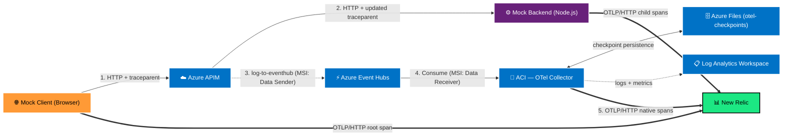

# Azure APIM → New Relic Distributed Trace Integration

[](LICENSE)

Event-driven OpenTelemetry pipeline that extracts distributed traces from Azure API Management (APIM) and forwards them to New Relic as native spans, producing a unified end-to-end trace across browser client, APIM gateway, and backend microservices.

## Architecture



```
Browser (mock-client)
  │  Generates root trace, injects W3C traceparent header
  │  Exports browser span → New Relic (OTLP/HTTP)
  ▼
Azure APIM
  │  Inbound: extracts traceId, generates apimSpanId, sets traceparent
  │  Outbound: captures actual sent traceparent, emits AppRequests JSON → Event Hubs
  ▼
Azure Event Hubs
  │  Decouples telemetry from the request path (async, no latency impact)
  ▼
Azure Container Instances — OTel Collector          ← terraform/ or bicep/
  │  azure_event_hub receiver (format: "azure") → native traces pipeline
  │  Checkpoint persistence: Azure Files share (otel-checkpoints)
  │  Liveness probe: HTTP health check on port 13133
  │  Logs + metrics → Log Analytics Workspace
  │  Exports OTel spans → New Relic (OTLP/HTTP)
  ▼
Azure Container Instances — Mock Backend            ← demo/terraform/ or demo/bicep/
  │  Node.js/Express; reads forwarded traceparent from APIM
  │  Exports child spans → New Relic (OTLP/HTTP)
  ▼
New Relic
  └─ Unified Distributed Trace: Browser → APIM → Backend
     3 distinct entities in the Service Map
```

See [architecture.md](architecture.md) for component breakdown, AppRequests field mapping, and security model.

## Scope and going further

This repo focuses exclusively on **distributed traces** — W3C `traceparent` propagation through APIM, captured via the APIM Logger policy, forwarded through Event Hubs, and delivered to New Relic as native OTel spans. After deploying, you will see a unified 3-entity trace (browser client → APIM gateway → backend) in New Relic Distributed Tracing.

What it does **not** cover:

- **APIM platform metrics** (request count, latency, error rate, gateway capacity) — these are published to Azure Monitor, not to Event Hubs.
- **APIM gateway logs** (GatewayLogs — full request/response detail per call) — also Azure Monitor Diagnostic Settings, separate from the APIM Logger used here.

### APIM metrics → New Relic

APIM platform metrics are available in New Relic via the native [Azure Monitor polling integration](https://docs.newrelic.com/docs/infrastructure/microsoft-azure-integrations/azure-integrations-list/azure-api-management-monitoring-integration/). This requires linking your Azure subscription to New Relic once (service principal or managed identity). Once configured, all `microsoft.apimanagement/service` metrics appear as New Relic dimensional metrics — no additional infrastructure required.

### APIM gateway logs → New Relic

Enable **Diagnostic Settings** on your APIM instance to export `GatewayLogs`. Two forwarding paths:

**Option A — Event Hub → New Relic Log API** (lower latency, ~seconds)
1. Diagnostic Settings: `GatewayLogs` → Event Hub (a separate namespace from the one used for traces, or a different consumer group on the same one).
2. Deploy the [New Relic Azure Functions log forwarder](https://github.com/newrelic/newrelic-azure-functions) to read from the Event Hub and POST to the [New Relic Log API](https://docs.newrelic.com/docs/logs/log-api/introduction-log-api/).

**Option B — Log Analytics Workspace → New Relic** (simpler, ~5 min latency)
1. Diagnostic Settings: `GatewayLogs` → Log Analytics Workspace (the same LAW deployed by this repo's Terraform/Bicep can be reused).
2. Connect the LAW to New Relic via the [Azure Log Analytics integration](https://docs.newrelic.com/docs/infrastructure/microsoft-azure-integrations/azure-integrations-list/azure-log-analytics-monitoring-integration/).

## Repository Structure

```
.
├── apim-policy.xml.tpl          # APIM policy template (rendered by demo/terraform/)
├── otel-collector-config.yaml   # OTel Collector config (injected as env var by terraform/)
├── architecture.md              # Mermaid diagram + component breakdown
│
├── scripts/
│   └── escape-apim-policy.py    # Renders + escapes apim-policy.xml.tpl for ARM API compatibility
│
├── bicep/                       # ── Telemetry pipeline — Bicep (deploy first) ───────
│   ├── main.bicep               # Event Hub, Storage, ACI OTel Collector, Log Analytics, RBAC
│   ├── apim-logger.bicep        # Cross-RG module: APIM logger (deploys into APIM resource group)
│   └── main.bicepparam.example
│
├── terraform/                   # ── Telemetry pipeline — Terraform (deploy first) ───
│   ├── main.tf                  # Event Hub, Storage, ACI OTel Collector, Log Analytics, RBAC
│   ├── variables.tf
│   ├── locals.tf
│   ├── outputs.tf
│   └── terraform.tfvars.example
│
└── demo/                        # ── Demo scaffolding (deploy second) ───────────────
    ├── bicep/                   # Demo API in APIM + mock-backend ACI — Bicep
    │   ├── main.bicep
    │   ├── apim-demo.bicep      # Cross-RG module: APIM API, backend, policy
    │   ├── apim-policy-escaped.xml  # Pre-escaped policy XML for ARM API compatibility
    │   └── main.bicepparam.example
    ├── terraform/               # Demo API in APIM + mock-backend ACI — Terraform
    │   ├── main.tf
    │   ├── variables.tf
    │   ├── locals.tf
    │   ├── outputs.tf
    │   └── terraform.tfvars.example
    ├── docker-compose.yml       # Runs mock-client locally
    ├── .env.example
    ├── backend/                 # Node.js Express app — deployed to ACI
    │   ├── server.js
    │   ├── tracing.js
    │   ├── package.json
    │   └── Dockerfile
    └── client/                  # Browser app — runs locally via docker-compose
        ├── index.html
        ├── nginx.conf
        └── Dockerfile
```

> **Separation of concerns:** `terraform/` and `bicep/` are the deliverable — the telemetry pipeline a customer adopts alongside their existing APIM instance. `demo/terraform/` and `demo/bicep/` are scaffolding that provisions a demo API and a publicly reachable mock backend for end-to-end validation.

## How Trace Correlation Works

W3C `traceparent` format: `00-{traceId(32 hex)}-{spanId(16 hex)}-{flags}`

1. **Browser** generates `traceId` and `rootSpanId`, sends request to APIM with `traceparent: 00-<traceId>-<rootSpanId>-01`.
2. **APIM inbound** extracts `traceId` and `rootSpanId`, generates `manualApimSpanId`, sets `traceparent: 00-<traceId>-<manualApimSpanId>-01`. If APIM diagnostics are enabled, the native W3C engine may overwrite this with its own span ID — both cases are handled.
3. **APIM outbound** reads `context.Request.Headers["traceparent"]` to capture the *actual* span ID sent to the backend (`finalApimSpanId`), then emits an Application Insights `AppRequests` JSON record to Event Hubs containing `traceId`, `finalApimSpanId`, and `rootSpanId` as parent.
4. **OTel Collector** receives the record via the `azure_event_hub` receiver, which natively maps `AppRequests` fields to OTel span fields and exports a native span to New Relic.
5. **Backend** receives `traceparent: 00-<traceId>-<finalApimSpanId>-01`. Its OTel SDK creates a child span parented under `finalApimSpanId`.

All three spans share the same `traceId` → New Relic links them into one distributed trace.

> **Important: APIM diagnostics can silently overwrite the span ID**
>
> When Azure API Management diagnostics are enabled (e.g. Application Insights integration, built-in logging), APIM's native W3C trace context engine intercepts the outbound request and **replaces the `traceparent` header with its own generated span ID** — overwriting the `manualApimSpanId` set by the inbound policy.
>
> If your APIM policy reports `manualApimSpanId` to Event Hubs but the backend receives a *different* span ID (the one APIM's diagnostics engine generated), the backend span will be parented under an ID that was never reported to New Relic. The result is a **broken distributed trace** — New Relic receives three spans that share a `traceId` but cannot be linked into a single trace.
>
> The policy in this repo handles both cases correctly by reading `context.Request.Headers["traceparent"]` in the **outbound** policy — after any diagnostics engine rewriting has occurred — to capture the `finalApimSpanId` that was actually sent to the backend. This value is what gets reported to Event Hubs, ensuring the APIM span and backend span are always correctly linked.
>
> If you adapt the APIM policy, preserve this outbound capture step. Reporting the span ID from the inbound policy is not sufficient when diagnostics are enabled.

## Sampling

The pipeline logs every APIM request to Event Hub by default. At scale you will want to reduce
volume. Sampling can be applied at two layers with different cost/fidelity trade-offs.

### Layer 1 — APIM policy (filter before Event Hub)

Wrapping `<log-to-eventhub>` in a `<choose>` condition prevents Event Hub writes entirely for
filtered requests — the most cost-effective option. Suitable for known low-value traffic:

```xml
<choose>
  <when condition="@(
    context.Request.Method == "OPTIONS" ||
    context.Request.Url.Path.Contains("/health")
  )">
    <!-- skip logging -->
  </when>
  <otherwise>
    <log-to-eventhub logger-id="{{APIM_LOGGER_ID}}" partition-id="0">
      <!-- existing payload expression -->
    </log-to-eventhub>
  </otherwise>
</choose>
```

Keep conditions simple — they execute on every request, including those that are not sampled.

### Layer 2 — OTel Collector (filter before New Relic)

Add a processor to `otel-collector-config.yaml`. This does not reduce Event Hub costs (messages
are already consumed) but reduces New Relic ingest volume.

**Probabilistic sampler** — simplest option, keeps a fixed percentage of all traces:

```yaml
processors:
  probabilistic_sampler:
    sampling_percentage: 10
```

**Tail sampling** — keeps 100% of errors and slow traces, samples the rest:

```yaml
processors:
  tail_sampling:
    decision_wait: 10s
    policies:
      - name: keep-errors
        type: status_code
        status_code: {status_codes: [ERROR]}
      - name: keep-slow
        type: latency
        latency: {threshold_ms: 5000}
      - name: probabilistic-rest
        type: probabilistic
        probabilistic: {sampling_percentage: 10}
```

Add the processor to the traces pipeline:

```yaml
service:
  pipelines:
    traces:
      receivers: [azure_event_hub]
      processors: [memory_limiter, tail_sampling, batch]
      exporters: [otlphttp/newrelic]
```

Tail sampling buffers spans in memory during `decision_wait`. The default 1 GiB ACI allocation
handles moderate throughput comfortably — increase `otelCollectorMemoryGb` in your
Bicep/Terraform parameters for high-volume deployments.

### Recommended hybrid strategy

| Traffic type | APIM layer | Collector layer |
|---|---|---|
| Health checks, OPTIONS | Filter out — no Event Hub write | N/A |
| Normal successful requests | Log all | Keep 10% (probabilistic) |
| Error responses (4xx/5xx) | Log all | Keep 100% |
| Slow requests (> 5 s) | Log all | Keep 100% |

## Prerequisites

- Azure subscription with Contributor access on the target resource group (Bicep also requires Contributor on the APIM resource group — see [Required permissions](#option-b--bicep))
- Existing APIM instance with system-assigned managed identity enabled
- Terraform >= 1.1
- Docker + Docker Compose (for running the mock client locally)
- New Relic account with a valid ingest license key
- A container registry to host the mock-backend image (Docker Hub, GHCR, ACR, etc.)

## Deployment

Two IaC options are available — Terraform and Bicep (Microsoft-native). Both produce identical resources. Choose one.

---

### Option A — Terraform

### Step 1 — Telemetry Pipeline (`terraform/`)

```bash
cd terraform

cp terraform.tfvars.example terraform.tfvars
# Edit terraform.tfvars with your resource group, APIM instance name, etc.
# Inject the license key via env var rather than committing it:
export TF_VAR_new_relic_license_key="your_40_char_license_key"

terraform init
terraform plan
terraform apply
```

**Resources created:**
- Event Hub Namespace + Event Hub + consumer group
- Storage Account + Azure Files share (`otel-checkpoints`) — OTel Collector checkpoint persistence across restarts
- Log Analytics Workspace
- ACI Container Group (OTel Collector) with Azure Files volume mount, liveness probe, and config injected as env var
- Diagnostic Setting (ACI logs + metrics → Log Analytics)
- APIM Logger (`apim-eventhub-logger`)
- RBAC: APIM MSI → Event Hubs Data Sender
- RBAC: ACI MSI → Event Hubs Data Receiver

### Step 2 — Demo Scaffolding (`demo/terraform/`)

Build and push the mock-backend image first:

```bash
# Build for linux/amd64 — required on Apple Silicon
docker build --platform linux/amd64 \
  -t <your-registry>/mock-backend:latest \
  demo/backend

docker push <your-registry>/mock-backend:latest
```

Then deploy:

```bash
cd demo/terraform

cp terraform.tfvars.example terraform.tfvars
# Set mock_backend_image to your registry image
export TF_VAR_new_relic_license_key="your_40_char_license_key"

terraform init
terraform plan
terraform apply
```

**Resources created:**
- ACI Container Group running the mock-backend
- APIM API (`apim-telemetry-demo`, path `/demo`)
- APIM Backend (points to mock-backend ACI public FQDN)
- APIM API Policy (rendered from `apim-policy.xml.tpl`)

---

### Option B — Bicep

#### Step 1 — Telemetry Pipeline (`bicep/`)

```bash
cp bicep/main.bicepparam.example bicep/main.bicepparam
# Edit bicep/main.bicepparam — set apimName, apimResourceGroupName, and newRelicLicenseKey directly in the file

bicep build-params bicep/main.bicepparam --outfile /tmp/main-params.json
bicep build bicep/main.bicep --outfile /tmp/main-arm.json

az deployment group create \
  --resource-group <your-resource-group> \
  --template-file /tmp/main-arm.json \
  --parameters @/tmp/main-params.json
```

> **Note:** The standalone `bicep` binary is used here to pre-compile the template and parameters to ARM JSON before deployment. This avoids SSL certificate errors that occur when the Azure CLI attempts to check the latest Bicep version against `downloads.bicep.azure.com` on networks with a corporate SSL proxy. Install it from [https://github.com/Azure/bicep/releases](https://github.com/Azure/bicep/releases) if not already present.

> **Required permissions:** The deploying identity needs Contributor on both the telemetry pipeline resource group and the APIM resource group. The APIM resource group permission is needed because the APIM logger is created via a cross-RG nested deployment (`Microsoft.Resources/deployments/write`).

#### Step 2 — Demo Scaffolding (`demo/bicep/`)

Build and push the mock-backend image first (see [Option A Step 2](#step-2--demo-scaffolding-demobicep) for the docker commands), then:

```bash
cp demo/bicep/main.bicepparam.example demo/bicep/main.bicepparam
# Edit demo/bicep/main.bicepparam — set mockBackendImage, apimName, apimResourceGroupName, and newRelicLicenseKey directly in the file

bicep build-params demo/bicep/main.bicepparam --outfile /tmp/demo-params.json
bicep build demo/bicep/main.bicep --outfile /tmp/demo-arm.json

az deployment group create \
  --resource-group <your-resource-group> \
  --template-file /tmp/demo-arm.json \
  --parameters @/tmp/demo-params.json
```

### Step 3 — Mock Client (`demo/docker-compose.yml`)

```bash
cd demo

cp .env.example .env
# Edit .env — set NEW_RELIC_LICENSE_KEY and APIM_ENDPOINT:
#   NEW_RELIC_LICENSE_KEY=your_40_char_key
#   APIM_ENDPOINT=https://<your-apim>.azure-api.net/demo   # note the /demo path suffix

docker-compose up --build
```

Open `http://localhost:8081` and click **Send Traced Request via APIM**.

### Step 4 — Verify

```bash
# Check OTel Collector is running
az container show \
  --name $(cd terraform && terraform output -raw container_group_name) \
  --resource-group <your-resource-group> \
  --query instanceView.state

# Stream OTel Collector logs
az container logs \
  --name $(cd terraform && terraform output -raw container_group_name) \
  --resource-group <your-resource-group> \
  --follow
```

After ~30 seconds, navigate to **New Relic → Distributed Tracing** and search by trace ID. You should see three connected spans:

| Entity | Source |
|--------|--------|
| `mock-client` | Browser OTLP export |
| `apim-gateway` | OTel Collector (from Event Hubs) |
| `mock-backend` | Node.js OTLP export |

In **New Relic → APM & Services** you will also see an `otelcol-contrib` entity. This is the OTel Collector reporting its own internal health metrics (queue depth, spans accepted/refused, exporter success/failure, memory usage) via the `service.telemetry.metrics` configuration in `otel-collector-config.yaml`.

The `apim-gateway`, `mock-client`, and `mock-backend` entities will appear in APM & Services but show no throughput or response time — these are populated from **metrics**, and this integration emits **traces** only. To get APM golden signals for these services you would need to configure OTel metric exporters in each (e.g. `http.server.request.duration` histograms from the Node.js SDK). That is out of scope for this integration.

## Configuration Reference

### OTel Collector environment variables (set by Terraform)

| Variable | Description |
|----------|-------------|
| `NEW_RELIC_LICENSE_KEY` | New Relic 40-char ingest license key (secure) |
| `AZURE_EVENTHUB_CONNECTION` | MSI-based Event Hub connection string |
| `OTEL_CONFIG_YAML` | Base64-encoded collector YAML config (secure) |

### Mock backend environment variables

| Variable | Default | Description |
|----------|---------|-------------|
| `NEW_RELIC_LICENSE_KEY` | — | New Relic ingest key |
| `OTEL_SERVICE_NAME` | `mock-backend` | Service name in New Relic |
| `OTEL_EXPORTER_OTLP_ENDPOINT` | `https://otlp.nr-data.net:4318` | OTLP endpoint |
| `PORT` | `3001` | HTTP listen port |

## Teardown

Always destroy the demo stack first, then the core pipeline — the reverse of deployment order.

### Terraform

```bash
# 1. Demo stack
cd demo/terraform
terraform destroy

# 2. Core pipeline
cd ../../terraform
terraform destroy
```

### Bicep

Bicep/ARM has no built-in destroy equivalent — there is no single command like `terraform destroy`. Resources must be deleted explicitly. The APIM resources (logger, API, backend) live in a different resource group from the pipeline resources, so two sets of deletions are needed.

```bash
RG="<your-resource-group>"
SUB="<your-subscription-id>"
APIM_RG="<resource-group-containing-apim>"
APIM="<your-apim-instance-name>"
APIM_BASE="https://management.azure.com/subscriptions/${SUB}/resourceGroups/${APIM_RG}/providers/Microsoft.ApiManagement/service/${APIM}"

# Demo stack — APIM resources (use az rest; az apim subcommands not available in all CLI versions)
az rest --method DELETE --url "${APIM_BASE}/apis/apim-telemetry-demo?api-version=2022-08-01&deleteRevisions=true"
az rest --method DELETE --url "${APIM_BASE}/backends/mock-backend?api-version=2022-08-01"
az container delete --resource-group $RG --name aci-mock-backend-<env>-<location> --yes

# Core pipeline — APIM logger
az rest --method DELETE --url "${APIM_BASE}/loggers/apim-eventhub-logger?api-version=2022-08-01"

# Core pipeline — telemetry RG resources
az container delete           --resource-group $RG --name aci-otel-collector-<env>-<location> --yes
az storage account delete     --resource-group $RG --name <storage-account-name> --yes
az eventhubs namespace delete --resource-group $RG --name evhns-apim-telemetry-<env>-<location>
az monitor log-analytics workspace delete --resource-group $RG --workspace-name law-apim-telemetry-<env>-<location> --yes --force
```

> **Note:** Replace `<env>`, `<location>`, and `<storage-account-name>` with the values from your parameters file (e.g. `dev`, `weu`, `ststdotelchkdevweu`). The `--force` flag on the Log Analytics workspace bypasses the soft-delete retention period.

### What is NOT removed

The following resources are pre-existing and are not managed by either IaC stack — they will remain after teardown:

- The APIM instance itself
- The resource group(s)
- Any RBAC assignments at the subscription level

### Verification

After teardown, confirm no resources remain:

```bash
az resource list --resource-group <your-resource-group> --output table
```

---

## Testing

All tests run locally without Azure credentials. Docker is required only for the collector config test.

```bash
# Run all tests
make test

# Individual suites
make test-collector   # otel-collector-config.yaml (requires Docker)
make test-policy      # apim-policy.xml.tpl structure + AppRequests schema
make test-terraform   # terraform init + validate (terraform/ and demo/terraform/)
make test-bicep       # bicep build (bicep/ and demo/bicep/)
```

### Test suites

| Suite | Script | What it checks |
|-------|--------|----------------|
| Collector | `tests/collector/validate.sh` | Config parsed by the real `otelcol-contrib` binary (Docker) |
| Policy | `tests/policy/validate.sh` | Policy structure, all AppRequests fields, template vars present |
| Terraform | `tests/terraform/validate.sh` | `terraform init -backend=false` + `terraform validate`; optional `tflint` |
| Bicep | `tests/bicep/validate.sh` | `bicep build` or `az bicep build` — compiles to ARM JSON locally |

CI runs all four suites on every push and pull request via `.github/workflows/ci.yml`. End-to-end integration tests (Event Hub → New Relic) require an Azure subscription and are out of scope for automated CI.

---

## Troubleshooting

**Enable debug logging in the OTel Collector:**

Uncomment the `debug` exporter in `otel-collector-config.yaml` and add it to the pipeline exporters list, then redeploy:

```yaml
exporters:
  debug:
    verbosity: detailed

service:
  pipelines:
    traces:
      exporters: [debug, otlp_http/newrelic]
```

Then stream logs with `az container logs --follow`.

**Storage account creation blocked by naming policy:**

Some organisations enforce Azure Policy rules that require storage account names to follow a specific prefix convention (e.g. must start with `ststd` or `stprm`). The default generated name (`stotelchk<env><location>`) will be blocked in those environments. Override it in `terraform.tfvars`:

```hcl
storage_account_name = "ststdotelchkdevweu"   # adjust prefix and suffix to match your policy
```

The variable accepts any valid storage account name (3–24 lowercase alphanumeric characters).

---

**Known limitation — Event Hub network rule sets:**

The `azurerm_eventhub_namespace` resource includes `lifecycle { ignore_changes = [network_rulesets] }`. The azurerm provider (≥ 3.x) attempts to read `networkRuleSets` on every plan/apply, which requires a permission typically not granted in governed subscriptions. This ignore causes no loss of fidelity as this Terraform does not manage network rules.

---

Licensed under the [Apache License 2.0](LICENSE).

