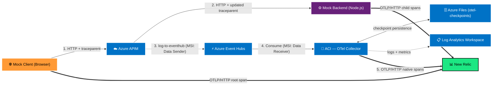

# Architecture: Azure APIM → New Relic Distributed Trace Integration

Event-driven OpenTelemetry pipeline that extracts distributed traces from Azure API Management and forwards them to New Relic as native spans, producing a unified end-to-end trace across browser client, APIM gateway, and backend microservices.

## System Topology

## Request & Telemetry Flow

### Synchronous path (steps 1–2)
1. The browser client generates a root `traceId` and `spanId`, builds a W3C `traceparent` header, and sends an HTTP request to APIM.
2. APIM's inbound policy extracts the `traceId` and client `spanId`. It generates a manual `apimSpanId` and sets `traceparent: 00-{traceId}-{apimSpanId}-01` on the outbound request. APIM's native W3C correlation engine may overwrite this with its own span ID — the outbound policy captures whichever value was actually sent.
3. The backend receives the traceparent and uses it as parent context for its child spans.

### Async telemetry path (steps 3–5)
4. APIM's outbound policy reads `context.Request.Headers["traceparent"]` to capture the exact span ID sent to the backend, then emits an Azure Application Insights `AppRequests`-schema JSON record to Event Hubs.
5. The OTel Collector's `azure_event_hub` receiver (`format: "azure"`) consumes the record and natively maps it to an OTel span — no transform processor required.
6. The span is exported to New Relic via OTLP/HTTP alongside the browser and backend spans, all sharing the same `traceId`.

## Component Breakdown

### Azure API Management
- Inbound policy: parses incoming `traceparent` (or seeds a new one), generates `manualApimSpanId`, sets outbound `traceparent` header.
- Outbound policy: captures the actual sent `traceparent`, emits `AppRequests` JSON to Event Hubs via `<log-to-eventhub>`.
- Auth to Event Hubs: System-Assigned Managed Identity with **Azure Event Hubs Data Sender** role.

### Azure Event Hubs
- Decouples telemetry extraction from the request path — fire-and-forget, no latency impact on APIM.
- Standard tier, 1 partition minimum for dev/test.

### Azure Container Instances — OTel Collector
- Runs `otel/opentelemetry-collector-contrib`.
- Receiver: `azure_event_hub` with `format: "azure"` — produces native OTel spans via a `traces` pipeline.
- Exporter: `otlp_http/newrelic` → `https://otlp.nr-data.net:4318`.
- Config injected as a secure environment variable (`OTEL_CONFIG_YAML`).
- Auth to Event Hubs: System-Assigned Managed Identity with **Azure Event Hubs Data Receiver** role.
- New Relic license key injected as a secure (encrypted) ACI environment variable.
- **Checkpoint persistence:** Azure Files share (`otel-checkpoints`) mounted at `/var/lib/otelcol/checkpoints` via the `file_storage` extension. The Event Hub consumer offset survives container restarts — no duplicate or missed spans.
- **Liveness probe:** HTTP GET on port 13133 (OTel health check endpoint). ACI restarts the container automatically if the collector becomes unresponsive.
- **Observability:** Diagnostic setting streams ACI container logs and metrics to Log Analytics Workspace for operational monitoring.

### AppRequests field mapping

The APIM policy formats the Event Hub payload as an Application Insights `AppRequests` record. The receiver maps fields to OTel span fields natively:

| AppRequests field        | OTel span field              |
|--------------------------|------------------------------|
| `OperationId`            | `trace.id`                   |
| `Id`                     | `span.id`                    |
| `ParentId`               | `span.parentSpanId`          |
| `Name`                   | `span.name`                  |
| `AppRoleName`            | `service.name` (resource)    |
| `time` + `DurationMs`    | `start_time` / `end_time`    |
| `ResultCode`             | `http.response.status_code`  |
| `Url`                    | `http.url`                   |
| `Properties.HTTP Method` | `http.method`                |

Setting `AppRoleName: "apim-gateway"` causes New Relic to synthesize APIM as a named entity in the Service Map.

## Security Model

| Connection | Auth |
|------------|------|
| APIM → Event Hubs | System-Assigned MSI — **Event Hubs Data Sender** |
| ACI (OTel Collector) → Event Hubs | System-Assigned MSI — **Event Hubs Data Receiver** |
| ACI (OTel Collector) → Azure Files | Storage account key — injected at deploy time via `listKeys()`, not stored in code |
| ACI (OTel Collector) → New Relic | License key — ACI secure environment variable |
| ACI (Mock Backend) → New Relic | License key — ACI secure environment variable |
| Browser → New Relic | License key — injected via nginx environment variable |

No connection strings are stored in code. The New Relic license key is marked `sensitive` in Terraform and injected as an encrypted ACI secret at apply time.
